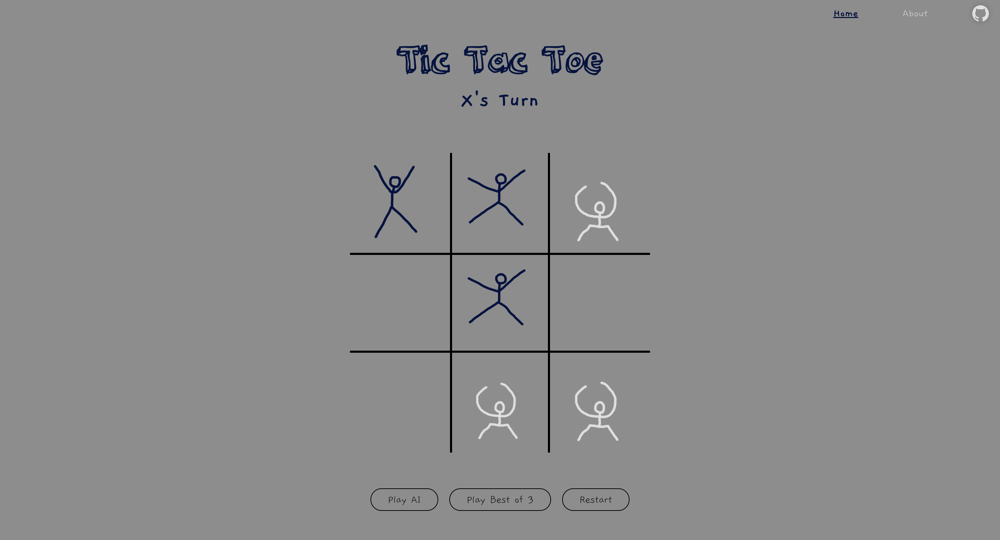

# Tic Tac Toe
### Odin Javascript Project: Tic Tac Toe
#### By Cory Suzuki
#### Submitted on 24-07-25

    This is a simple Tic Tac Toe game that I created as part of the Odin Project's Javascript curriculum. The game is played in the browser and uses the module pattern to organize the code. The game is played by two players, and the game board is updated with the player's moves. The game will end when a player wins or when the game is a draw. At any point, the game can be restarted. 

#### New Concepts

- **Factory Functions:** The lessons leading up to this project focused on factory functions and the module pattern. I'm glad to finally be introduced to these concepts. I'm usually pretty good about googling things concepts I don't understand right away to satisfy my curiosity. But for some reason, I've let factory functions live in my head as some kind of boogeyman. Anyway, turns out they're actually not all that complicated.

- **Module Pattern:** The module pattern is also a concept that I've heard about but never really understood. I was definitely getting the 'module pattern' confused with JavaScript modules. The module pattern is a way to organize your code and keep it from polluting the global scope. It's a way to create private variables and functions in JavaScript. And JavaScript modules are a way to import and export code between files.

 
    I'm happy to finally be dipping my toes into some more 'advanced' JavaScript concepts. Prior to this course, 
    most of my coding experience has been with Python. While web development isn't at the top of my list of interests, I would like to really understand JavaScript and be able to use it effectively.

### Features

- Two player game
- Game board updates with player moves
- Game ends when a player wins or when the game is a draw
- Game can be restarted at any time
- I drew fancy stick figures for the game pieces
- Random chance that you might catch one of the stick figures off guard
- Mobile responsive design
- AI opponent using the minimax algorithm (with 5% chance it makes a random move instead of the best move)
- 'Best of 3 mode' for PVP and AI modes

### Additional Features 

#### Additional Features - Planning
##### As of now (7/22/2024), the project is complete and working great. However, throughout the process I've come across a few additional ideas that I want to try to implement. 

- **AI Opponent:** Obviously it's not too exciting to play tic tac toe against yourself. And I'm not about to host this website so I can hop in Discord with the boys and play tic tac toe. So I had the thought of creating an AI opponent. I googled how I might go about this to get some inspiration and it seems like every tutorial on creating a tic tac toe AI uses the minimax algorithm. So I figured that would be a good place to start. While it was confusing at first, the algorithm is really incredibly simple. In a nutshell, the algorithm is a recursive function that simulates every possible move that can be made in the game and assigns a score to each move. An important feature of the algorithm is how it factors in the opponent making the best move possible. 

- **Difficulty Levels:** I thought it would be cool to have different difficulty levels for the AI opponent. I could have the AI make random moves, make moves based on a simple heuristic, or use the minimax algorithm, or a combination of these methods.

- **Score Board:** Simple enough, but I'd like to be able to keep track of the score between two players. Should it be an opt-in feature or should I have the scoreboard start counting by default? I'm not sure yet.

- **Efficient Win Checking:** While refactoring my JavaScript and checking all the code, I became curious about how I could optimize the win checking function. Currently, the function checks every possible win condition every time a player makes a move. I thought it would be cool to have the function only check the win conditions that are affected by the player's move. Basically, just checking the row, column, and diagonal that the player's move is in. I ended up going deep down a rabbit hole and learned about bitwise win checking. It looked crazy at first, but now that I understand how it works, it really does seem like the best option. None of this actually matters for this game, but I may try to implement a couple alternative win checking functions to learn about other ways to approach such a problem.

#### Additional Features - Implementation

- First of all, I decided to scrap the idea of modifying the win checking function. I ended up spending more time than I expected trying to get the score board to work and refactor the code to be fully modular. 

- **Best of 3 Mode:** For the score board feature, I just implemented a 'best of 3 mode' where first player to win 2 games wins. This mode works in PVP and AI modes.

- **AI Opponent:** I created an AI opponent using the minimax algorithm. There were so many JavaScript examples available online, but I wanted to see if I could figure it out on my own. So I watched a few videos that break down the algorithm itself and one where the algorithm is implemented in Python. Once I fully wrapped my head around how the minimax algorithm works, it was actually very easy to implement. Really, the only confusing aspect of the algorithm is its recursive nature. But thankfully, I learned all about recursion while taking CS50x (Shout out Professor Malan!). Glad I decided to add the AI opponent. It was a good challenge and really showed myself how much I've learned about coding in general in the last year.

### Final Thoughts

- **Final Thoughts:** I'm happy with how the project turned out. The last few projects feel like a level-up for me in terms of my understanding of JavaScript. I think spending hours working on these projects has made me much more comfortable with the language. I'm also happy that I was able to implement the minimax algorithm for the AI opponent. I think the game is fun to play and looks pretty good (I mean...it's tic tac toe so 'fun' is a bit of a stretch 🤷). On to the next project!

### Links

<a href="http://mypetlobster.github.io/tic-tac-toe">Try this project out here!</a>

 

<a href="https://www.theodinproject.com/lessons/node-path-javascript-tic-tac-toe">
    Here is a link to the Odin Project page for this project.
</a>

 

<a href="https://www.youtube.com/watch?v=fInYh90YMJU">
    Anchor Rainbow's Video - Let's Learn Python #21 - Min Max Algorithm
</a>

 

<a href="https://www.youtube.com/watch?v=SLgZhpDsrfc">
    Spanning Tree's Video - Minimax: How Computers Play Games
</a>